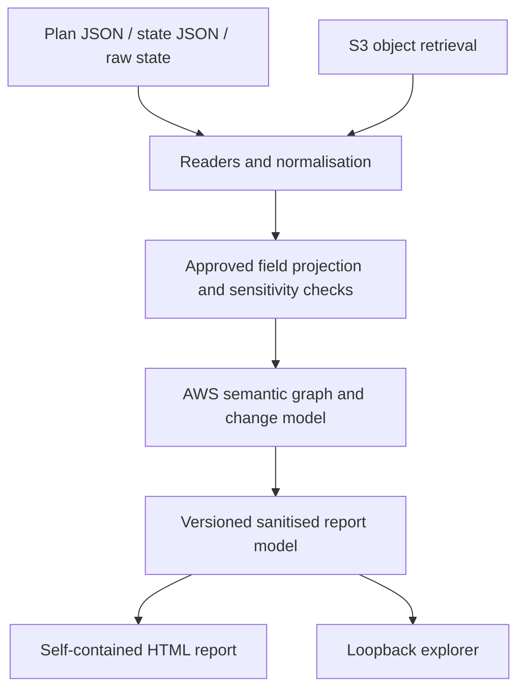

# Terraform/OpenTofu Visualiser — Product and Implementation Plan

**Prepared for:** Danushka Stanley  
**Date:** 30 September 2026  
**Status:** Proposed implementation plan  
**Working CLI name:** `tfviz` — a placeholder pending repository and naming checks

> A free, open-source tool that turns Terraform/OpenTofu plans and state into premium, interactive infrastructure diagrams, on a developer machine or as a downloadable CI artefact.

This plan defines the product, implementation sequence and release criteria. Commands and schemas below are proposed interfaces, not claims that an application already exists. Design targets and estimates must be validated during implementation.

## 1. Product direction

Build for DevOps and platform engineers who want to understand an infrastructure estate or review a proposed change without navigating thousands of lines of Terraform output.

The two core experiences are a self-contained HTML report generated in CI and a local explorer that reads a state snapshot. Both use the same sanitised graph and the same visual interface. Core use, including HTML generation and exploration, remains free and open source.

The defining qualities are thoughtful topology, excellent visual design, trustworthy change semantics and deliberate treatment of sensitive data. The interface should feel like a carefully designed professional desktop application: calm, precise and responsive.

**Product promise:** install a binary, provide a supported plan or state, and get an understandable diagram. No account, paid rendering service, database or Node.js runtime is required for end users.

Local file workflows operate offline. S3 workflows contact the configured AWS state and authentication services. Neither workflow uploads infrastructure information to a visualisation service or sends telemetry.

### What the tool can truthfully show

State represents Terraform/OpenTofu's recorded snapshot; it does not prove the infrastructure is currently identical in AWS. Plans describe proposed actions at the time they were generated. Every report must identify its source and generation time, and show source freshness only when that information is available.

The diagram describes recorded placement, associations and references. It does not establish actual packet flows, application behaviour or end-to-end network reachability.

## 2. Users and their jobs

| User | Trigger | Expected result |
| --- | --- | --- |
| DevOps engineer | A pipeline produces a Terraform plan | Download an HTML report, see additions, changes, deletions and replacements in context, then inspect relevant attributes |
| Platform engineer | Needs to understand an existing stack | Open a local state file or an S3 state object and explore the recorded infrastructure |
| Reviewer | An MSK, database or networking change needs scrutiny | Focus the affected resource, inspect its subnet and security group associations, and understand the proposed change |
| New team member | Needs to learn how a stack is organised | Switch between architecture and module views without losing resource identity |

Three initial review questions should drive the implementation: What changes? Where does it belong? What evidence supports its connections?

## 3. Scope and release boundaries

### First vertical slice

Start with one realistic AWS stack: VPC, subnets, security groups, an ALB, RDS, MSK and a Secrets Manager association. Include unchanged resources around the changes. Use synthetic Terraform and OpenTofu fixtures containing both known and unknown values.

Deliver a polished plan-to-HTML journey before expanding resource coverage or adding AWS authentication. This proves the hardest product assumption: whether the diagram helps someone review a real change.

### v1 release scope

- Plan JSON and state JSON ingestion, plus an explicitly supported raw-state reader.
- One HTML file containing the application and the sanitised report data.
- Local exploration with search, pan, zoom, focus, inspector and collapsible groups.
- Before, after and combined plan views with separate replacement semantics.
- AWS adapters for the resource families listed in section 9.
- Architecture and module views; resource search preserves exact addresses in the normal internal view.
- Local raw state and direct S3 state retrieval using the AWS SDK credential chain.
- Sensitive-value removal and a stricter `--safe-share` export.
- Light and dark themes, keyboard navigation and reduced-motion support.
- Versioned binaries and documentation for CI adoption.

### Deferred beyond v1

Live cloud inventory, cloud drift scanning, observed traffic, cost estimation, apply integration, Azure/GCP, HCP Terraform backend integration, cross-state merging, collaboration, accounts and a hosted service are later work. Broker-level or pod-level inventories require additional evidence and are not part of state-only visualisation.

SVG/PNG export is a useful next increment after the HTML experience works. Do not let image export delay the core release.

## 4. Input and compatibility contract

The canonical input is the documented JSON produced by `terraform show -json` or `tofu show -json`. A normalised resource representation separates input formats from provider adapters.[^tfshow][^tofushow]

```bash
# Terraform plan, piped directly into the proposed CLI.
terraform plan -out=tfplan
terraform show -json tfplan \
  | tfviz plan --input - --output infra-report.html

# OpenTofu equivalent.
tofu plan -out=tfplan
tofu show -json tfplan \
  | tfviz plan --input - --output infra-report.html

# Existing state, exported through the producer.
terraform show -json terraform.tfstate \
  | tfviz state --input - --output state-report.html
```

These JSON exports can contain plaintext sensitive values. Piping avoids creating an additional JSON file; it does not sanitise the producer's binary plan or state file.[^tfsensitive]

| Input | First slice | v1 behaviour |
| --- | --- | --- |
| Exported plan JSON | Required | Documented, fixture-tested versions supported |
| Exported state JSON | Required | Documented, fixture-tested versions supported |
| Raw `.tfstate` | Deferred | Dedicated reader for tested version-4 snapshots; other versions rejected with guidance |
| S3 state object | Deferred | Retrieve the exact object, then use the supported state reader |
| Binary plan file | Excluded | User exports JSON using the matching Terraform/OpenTofu environment |
| Encrypted OpenTofu state/plan | Producer export route | Use `tofu show -json` with the appropriate configuration and keys; direct encrypted-object decoding is deferred |
| Terraform/OpenTofu streaming JSON UI | Excluded | Reject with a hint to use `show -json`; do not confuse it with an exported plan |

OpenTofu supports state and plan encryption. Direct S3 retrieval must detect an encrypted envelope and offer the producer-export route, rather than attempting to bypass encryption or treating ciphertext as an empty stack.[^tofuencryption]

Maintain a published matrix of tested Terraform, OpenTofu and AWS provider versions. Choose and pin the initial matrix when building fixtures; do not advertise universal compatibility.

Validate the declared JSON format version. Tolerate compatible additions, reject unsupported major formats and preserve unknown action/coverage warnings. Missing sensitivity metadata must never cause a broad attribute dump.

For a generic remote backend, users can pull state with their existing tooling and supply a supported snapshot. Automatic backend discovery from a Terraform directory is a later convenience, not a prerequisite for the first release.

## 5. Proposed CLI

```bash
# Generate a review report.
tfviz plan --input plan.json --output infra-report.html

# Generate a report from recorded state.
tfviz state --input terraform.tfstate --output state-report.html

# Explore a local snapshot through a loopback server.
tfviz explore --state terraform.tfstate

# Explore an exact S3 state object using an existing AWS SSO profile.
aws sso login --profile work
tfviz explore \
  --state s3://example-state-bucket/prod/platform/terraform.tfstate \
  --aws-profile work \
  --aws-region eu-west-1

# Produce a report with identifying metadata removed.
tfviz plan --input plan.json --output shareable-report.html --safe-share

# Enforce an entirely offline local-file workflow.
tfviz plan --input plan.json --output infra-report.html --offline
```

`plan` and `state` generate reports; `explore` serves the same interface locally. `--input -` reads stdin. A local explorer starts once, reads a snapshot and refreshes only on an explicit user action.

Proposed common options: `--title`, `--theme system|light|dark`, `--view architecture|modules`, `--safe-share`, `--offline` and `--strict`. S3 options additionally include profile, region, optional object version and expected bucket owner. Command-specific help must reject inapplicable options.

Use exit code `0` for success, `1` for processing/retrieval failures and `2` for invalid arguments or unsupported input. An infrastructure change is a successful report, not an error. Partial coverage is visible in the report; `--strict` makes incomplete or unsupported interpretation fail CI explicitly.

Write output atomically with restricted permissions. Refuse accidental overwrites unless `--force` is supplied. Print a concise result and coverage count, never the input payload. Do not launch a browser from report-generation commands.

## 6. Architecture and stack

Use Go for the CLI, readers, AWS integration and semantic engine. Use React and TypeScript for the interface. Start with React Flow for interaction and evaluate ELK.js for layout. React Flow supports nested groups, and its open-source core is MIT-licensed; paid example code must not be assumed to share that licence.[^reactflow][^reactflowlicence]

Compile and embed the frontend assets in the Go binary. Developers need frontend build tools; end users do not. Keep dependency versions pinned and record bundled licences.



The processing engine may hold secret-bearing input in memory. The renderer and frontend accept only the sanitised model. There must be no generic raw-attributes fallback or frontend endpoint that exposes the source document.

Reader adapters handle input-specific details. AWS adapters define approved metadata and relationship rules. Graph construction, change handling, grouping and presentation remain separate responsibilities.

Perform the initial layout in the bundled application so the same layout code serves both modes. Use deterministic ordering and a fixed tie-breaking strategy to minimise movement between views. Prototype layout responsiveness and `file://` compatibility before committing to workers or complex packaging.

## 7. Sanitised report model

Define a versioned schema and validate it in Go and TypeScript. Its essential objects are:

- **Report:** schema version, mode, producer/tool versions, generation time, source-time status, coverage and completeness.
- **Resource:** opaque ID, approved display label, type, module, provider identity, change category and projected metadata.
- **Relationship:** source, target, relation type, before/after presence and an evidence category.
- **Group:** account/region/VPC/module/domain membership, explicitly distinguishing known and unresolved placement.
- **Metadata field:** approved path, value status and optional display value.
- **Change:** resource action, replacement order, safe changed-field paths and known/unknown comparison status.

Metadata statuses should be `known`, `sensitive`, `unknown`, `absent` and `omitted`. Sensitive fields have no value payload. This prevents a UI from showing a masked label while keeping the original value behind it.

A minimal illustrative field contract is:

```json
{
  "key": "master_password",
  "status": "sensitive",
  "change_status": "changed"
}
```

`change_status` is `unknown` when the comparison cannot be established. Do not export hashes or fingerprints of secret values.

Keep full Terraform addresses, `count` indexes, `for_each` keys and module instances internally for matching. Safe-share output replaces identifying fields consistently, including those in search indexes, relationship evidence and diagnostics.

The frontend must not contain a generic `attributes: map[string]any` copied from Terraform. Unsupported resource types receive an explicitly limited generic card, not raw details.

## 8. Plan interpretation

Terraform's exported plan provides action lists, sensitivity markers, unknown-value markers and replacement paths. Interpret these in the reader, rather than making the interface guess.[^tfformats]

| Input action | Report treatment |
| --- | --- |
| `no-op` | Unchanged context |
| `create` | Addition |
| `update` | Modification |
| `delete` | Destruction |
| `delete, create` | Replacement; delete first |
| `create, delete` | Replacement; create first |
| `read` | Data-source read, distinct from infrastructure creation |
| Unrecognised action | Explicit unsupported-action warning; strict mode fails |

Recognised imports and address moves are separate annotations. Never present a move as destroying and recreating infrastructure. If a supported producer emits removal from state without destruction, label it accordingly; otherwise mark that action unsupported.

Build the before graph from available prior values and the after graph from planned values. Preserve deleted resources and their previous connections in the combined view. Use configuration references only where they resolve unambiguously; an unknown new resource ID must not become an invented connection.

Allow reviewers to switch between **Before**, **After** and **Changes**. Keep matching resources in consistent positions and distinguish old and new edges. Count replacements separately in the UI; explain how that differs from Terraform's add/destroy totals.

Treat unknown values as known after apply, not null or deleted. Missing data, deferred work and targeted/incomplete inputs must be visible. Carry producer completeness indicators where present; do not infer full-stack coverage merely because parsing succeeded.

A sensitive-field comparison can say “Sensitive value changed” only when the engine can establish that fact from known input values. Otherwise use “Sensitive value; comparison unavailable”. Both before and after sensitivity markers constrain the exported comparison.

## 9. AWS resource coverage

Implement adapters in tiers. A supported family means its core placement, approved metadata and documented relationships are fixture-tested; it does not mean every provider attribute is available.

| Tier | Families and representative resource types | Required interpretation |
| --- | --- | --- |
| A: foundation | `aws_vpc`, `aws_subnet`, `aws_route_table`, route associations/routes, `aws_internet_gateway`, `aws_nat_gateway`, `aws_eip` | VPC containment, subnet/AZ placement and evidenced routing |
| A: security | `aws_security_group`, inline rules, standalone VPC SG ingress/egress rules | Attachments and configured rules, separate from proven reachability |
| A: example workloads | `aws_lb`, listeners/target groups, `aws_db_instance`, DB subnet groups, `aws_msk_cluster` | Multi-subnet associations, approved settings and related resources |
| A: secret references | `aws_secretsmanager_secret`, MSK SCRAM association resources | Reference-only secret cards and explicit cluster associations |
| B: compute | `aws_instance`, `aws_ecs_cluster`, `aws_ecs_service`, `aws_eks_cluster`, EKS node groups, `aws_lambda_function` | Placement where recorded and explicit service relationships |
| B: data | `aws_rds_cluster`, cluster instances, ElastiCache replication groups/clusters and subnet groups | Grouping, members and network attachments |
| B: regional services | `aws_s3_bucket`, `aws_sqs_queue`, `aws_sns_topic`, subscriptions, `aws_dynamodb_table` | Regional/service grouping and explicit references |
| B: support | CloudWatch log groups and KMS key references | Recorded log destinations and encryption references |

The first slice uses selected Tier A resources. A public v1 requires the advertised Tier A/B subset to pass its fixtures; publish the exact per-type support list. CloudFront, API Gateway, transit networking and remaining AWS types can follow demand.

An ALB, EKS or MSK cluster can span several subnets. Render one resource with membership links or proxy markers; do not duplicate it in a way that inflates resource counts. Global/regional services such as S3 or SQS must not be placed inside a VPC merely because an application uses them.

Infer account/region from explicit attributes, ARNs or available provider context. Preserve unknowns and avoid conflating the S3 backend's region with the workload region.

### Relationship evidence

Use separate types for containment, subnet membership, security group attachment, routing, service configuration references and secret associations. Display the evidence when a relationship is selected.

A security group rule describes configured permission. An endpoint describes an address. Neither proves an application communicates with another resource. Do not draw an EKS-to-RDS traffic edge simply because both exist in the same VPC.

Only classify a subnet as public/private when route-table evidence supports the specific label, including known associations. Otherwise show unknown placement/classification. Keep ambiguous references and external resources explicit.

## 10. MSK drill-down experience

Selecting an MSK node focuses its neighbourhood and opens an inspector. Expanding it reveals recorded subnet, security group, log and secret associations while keeping the parent stack visible through breadcrumbs.

Display available approved metadata: cluster name/ARN, Terraform address/module, region, VPC resolution, subnets/AZs, broker count/type, Kafka version, encryption settings, authentication modes and configured logging destinations.

Resolve Secrets Manager links through explicit association resources, such as an MSK SCRAM association's cluster ARN and secret ARN list.[^mskassociation] Show the secret reference and available approved metadata, never the stored username/password or secret body.

The tool must not call `GetSecretValue`, `BatchGetSecretValue` or retrieve decrypted SSM parameter contents. In v1, secret metadata comes from the input rather than extra inventory calls.

A state-only MSK view does not invent individual broker IDs, current health, lag or network traffic. Broker count is configuration metadata, not a live broker inventory.

## 11. Security and disclosure contract

### Before the renderer

Use a provider/resource-specific allowlist for exported metadata. Sensitivity information takes precedence over the allowlist. Add defensive secret-field exclusions for inputs that lack reliable marking; a blacklist alone is insufficient.

Do not export passwords, tokens, secret bodies, random-password results, private keys, certificate bodies, user data, scripts, environment-variable values or opaque JSON documents. Parse only specifically approved references from a container definition or policy-like document; never expose the entire document.

If an approved reference field is marked sensitive, suppress its relationship as well as its value. A graph edge can reveal information, so redaction applies to the whole report model.

Tags, resource names, descriptions and `for_each` keys can contain confidential or poorly placed secret material. Tags and free-form descriptions are omitted by default. Normal internal reports can include approved names, identifiers and addresses; safe-share replaces them. No heuristic can guarantee that an arbitrary name is harmless.

Raw input, literals from configuration, input variables and root outputs are not embedded in the report. Do not leak them through logs, errors, HTML attributes, hidden DOM, accessibility labels, clipboard operations or exports.

### Safe-share mode

Use consistent report-local pseudonyms for names, resource/module addresses, ARNs, account IDs, resource IDs, DNS names, IPs/CIDRs, bucket/key details and other identifying metadata. Keep service types, topology, broad region labels and change categories. Drop unknown metadata and scrub titles, warnings and search data too.

Keep pseudonymisation keys/mappings out of the artefact. The result is a topology-oriented disclosure mode, not a claim of anonymity: architecture itself may still be confidential.

### Input and browser hardening

Bound input size, JSON nesting and resource/edge counts. Reject malformed or unsupported inputs without dumping fragments. Escape all labels and serialize embedded data safely, including values containing closing script tags, HTML and control characters.

Use text rendering rather than injected HTML. Reject executable URL schemes. Open optional documentation/console links only on an explicit click; include no automatic remote icons, fonts or embeds. Avoid browser persistence of graph data.

The local server binds to loopback, checks Host/Origin, uses a per-run access token and sends no-store responses. It exposes only the projected report. Validate that unrelated websites cannot read the local graph. Do not provide arbitrary filesystem reads or AWS-operation endpoints to the browser.

Keep raw input in process memory where practical and minimise its lifetime. Do not promise guaranteed memory erasure in Go. If temporary raw files are required, restrict permissions and remove only files created by the tool. Never claim that masking in the UI sanitises a source file.

## 12. AWS credentials and S3 retrieval

Use AWS SDK for Go v2 configuration loading and its supported credential providers. Honour the selected profile and region; support existing SSO sessions, role profiles, environment credentials, web identity and workload roles.[^awsauth][^awssso]

An expired interactive SSO session receives actionable guidance to run `aws sso login --profile ...`. CI returns an authentication error rather than initiating an interactive login. Credentials remain in the standard AWS mechanisms and never enter the report.

Retrieve an exact bucket/key with `GetObject`. Support version selection and record available source timestamp/version information as metadata. That timestamp describes the object, not proof of current AWS infrastructure.

Scope access to the state object. Current-object reads require `s3:GetObject`; selecting a version uses `s3:GetObjectVersion`. Satisfy the applicable SSE-KMS authorisation requirements using permissions scoped to the relevant key.[^s3getobject] Document and verify the exact KMS requirements for the supported retrieval path before release.

Do not require bucket listing, writes, Terraform state locks or a broad cloud read-only role for this workflow. Preserve the distinction between the credentials used to obtain state and the workload accounts represented in it.

## 13. Premium visual design

Treat Apple-like quality as restraint, typography, spacing and interaction precision. Develop an original identity rather than copying Apple interfaces or bundling restricted brand assets.

Use soft neutral surfaces for the light theme and graphite surfaces for dark. Use a system-font stack, thin borders, restrained shadows and consistent spacing. Resource cards should have clear names, secondary technical labels and small, consistent monochrome symbols.

Colour communicates change: green for additions, amber for modifications, red for destruction, a distinct replacement accent and neutral unchanged resources. Pair colour with text and symbols so meaning survives colour-vision differences and monochrome output.

The canvas is the main surface. Keep the left navigator compact, the top toolbar quiet and the right inspector rich in detail. Metadata should be readable and copyable in the normal internal view. Keep product controls focused on review and exploration; input-format internals belong in documentation and diagnostics.

Required visual checks: readable labels at useful zoom levels, consistent card sizes, no card overlap, deliberate edge routing, adequate contrast, uncluttered group boundaries and polished empty/error states.

### Motion

Use short focus/zoom transitions and a restrained relationship trace on selection. Default motion is calm; provide a global toggle and honour `prefers-reduced-motion`.

An animation traces a recorded association, not observed traffic. Label it as a relationship trace. A later traffic overlay requires an explicit telemetry source and different semantics.

## 14. Navigation and interaction

| Area | Controls and information |
| --- | --- |
| Header | Report title, source mode, freshness status, change summary and theme |
| Left navigator | Search, resource/domain filters, module tree and change filters |
| Main canvas | Pan, zoom, fit, group expansion, focus and before/after/changes selector |
| Right inspector | Resource identity, approved metadata, safe changes and relationship evidence |
| Footer/status | Legend, coverage, unresolved relationships and reduced-motion control |

Architecture view groups by account, region and VPC where known, then by domains or subnet membership as appropriate. Module view groups by module instances using the same resource identities. Do not mix these hierarchies into an unreadable universal tree.

Click selects; double-click or an explicit expand action focuses a group. Breadcrumbs and Back restore the previous view. Search must find a collapsed resource, expand its path and focus it. Selection persists when changing views.

Provide a keyboard-accessible resource list and inspector alongside the graph. The graph must not be the only way to review changes.

## 15. HTML artefact contract

The generated `infra-report.html` contains all application code, styles, icons and projected data. It opens directly from disk without a server, CDN, browser extension, internet access or frontend runtime installation.

Avoid runtime fetches and external module/worker imports. If workers are needed, bundle them in a way verified under `file://` in the supported browsers. Use one security-reviewed export template and test its content policy with the actual graph library.

Use a restrictive Content Security Policy, including no external connections. Allow only the bundled scripts/styles and local resources required by the implementation; determine hashes and any worker/style exceptions from the build. Do not rely on CSP instead of escaping input.

Provide an initial static change summary and resource list so the report remains useful when JavaScript is blocked. Full diagram interaction requires JavaScript. Keep the report stable after the generating CLI is shut down.

A report exposes approved infrastructure metadata by design. Teams should apply their normal artefact access and retention controls. `--safe-share` reduces disclosure but does not make every architecture diagram public by default.

## 16. CI adoption

Publish tagged GitHub releases with platform binaries and checksums. Pipeline users pin a version and verify the download before running it; they should not pull an unpinned branch or execute a remote install script blindly. The following Jenkins example assumes the chosen binary is already installed.

```groovy
pipeline {
  agent any

  stages {
    stage('Infrastructure review report') {
      steps {
        sh(script: '''#!/usr/bin/env bash
set -euo pipefail
set +x
umask 077
mkdir -p artefacts
plan_path=$(mktemp)
trap 'rm -f "$plan_path"' EXIT

terraform plan -input=false -out="$plan_path"
terraform show -json "$plan_path" | tfviz plan --input - --output artefacts/infra-report.html --force
''')
      }
    }
  }

  post {
    success {
      archiveArtifacts(
        artifacts: 'artefacts/infra-report.html',
        fingerprint: true,
        allowEmptyArchive: false
      )
    }
  }
}
```

Use the same pattern in GitHub Actions, GitLab CI and Buildkite: create the plan, export JSON, generate the report and upload only the report. Existing apply workflows may need to retain the binary plan separately with their own restricted access; report generation does not replace that plan.

Jenkins commonly restricts scripts in served user artefacts through CSP. Downloading the HTML and opening it locally is the default supported path. Optional inline publishing should follow the administrator's approved isolated serving configuration, without weakening controller-wide security merely to display a diagram.[^jenkinscsp]

## 17. Repository and distribution

Use a single repository with these initial directories:

- `cmd/tfviz/` — CLI entry point.
- `internal/input/` — producer JSON and raw-state readers.
- `internal/source/` — local files, stdin and S3 retrieval.
- `internal/projection/` — sensitivity rules and approved metadata.
- `internal/provider/aws/` — resource and relationship adapters.
- `internal/graph/` — graph assembly, grouping and change logic.
- `internal/report/` — schema, HTML export and local serving.
- `web/` — TypeScript application, design tokens and graph components.
- `testdata/` — synthetic producer outputs and hostile/sensitive fixtures.
- `docs/` — input support, CLI, security, contributor and CI guides.
- `.github/workflows/` — validation and release pipelines.

Recommend Apache-2.0 for the project, subject to the final dependency/licence review. Include `LICENSE`, applicable notices, third-party notices, `SECURITY.md` and clear contribution guidance. Do not reuse proprietary visual assets or paid graph examples without permission.

Distribute macOS and Linux ARM64/AMD64 binaries first. Add Windows after its file-opening, browser and permission behaviour is tested. Publish checksums, SBOMs and release provenance/signatures where supported. Homebrew and a pinned container image are follow-up distribution channels.

## 18. Implementation milestones

These are sequencing estimates for a solo builder working around other commitments, not delivery promises. Review after each milestone rather than locking a launch date prematurely.

### M0 — Validate the design and risky assumptions

**Estimate: 2–4 focused sessions.** Create synthetic plan/state fixtures, the report schema and one polished light/dark canvas with an MSK inspector. Prove embedded JS, layout and inspection work when opening the HTML directly from disk.

**Exit:** a reviewer can understand the example topology; the UI direction is agreed; the export format works offline.

### M1 — First complete plan-to-report slice

**Estimate: 1–2 weeks.** Implement Go CLI skeleton, producer JSON reader, sensitivity projection, initial AWS adapters, change model and self-contained HTML generation. Include create/update/delete/replace/unknown cases and context resources.

**Exit:** the synthetic stack generates a useful report in one command; sentinel secrets never appear in outputs or logs; actions and connections match fixtures.

### M2 — State exploration and deeper interaction

**Estimate: 1–2 weeks.** Add state JSON, module grouping, search/focus, inspector, before/after switching, keyboard list and richer MSK associations. Implement and fixture-test the raw version-4 state reader.

**Exit:** equivalent supported state inputs produce equivalent projected topology; search works through collapsed groups; unsupported input fails clearly.

### M3 — S3 and AWS authentication

**Estimate: 3–5 focused sessions plus integration testing.** Add exact-object retrieval, profile/region options, existing SSO sessions, role profiles, object versions and actionable errors. Keep refresh explicit and SDK access outside the browser.

**Exit:** local credentials and a CI workload role can read a dedicated test-state object; no writes or secret-value APIs occur; encrypted OpenTofu inputs follow the documented export path.

### M4 — Coverage, hardening and public alpha

**Estimate: 1–2 weeks.** Expand the advertised adapters, complete safe-share, harden parsing/HTML/local serving, test CI and browser compatibility, benchmark medium/large fixtures and publish installation/contribution documentation.

**Exit:** the release checklist below passes and three external engineers complete the workflows without a guided call.

### M5 — v1 after real feedback

Fix layout, interpretation and onboarding problems found by alpha users. Only promote the tested resource/producer matrix to v1. Select subsequent resource adapters and exports from actual issues rather than adding every plausible feature.

A first public alpha is plausibly a 5–8-week side-project effort after M0; raw-state compatibility, safe export and layout are the main uncertainties. Re-estimate if those spikes expose substantial work.

## 19. Verification and release criteria

Security and graph correctness deserve substantive automated tests because a plausible diagram or masked UI can conceal a serious defect.

- [ ] Terraform and OpenTofu fixture matrices cover supported formats and nested modules, `count`/`for_each`, data sources and duplicate references.
- [ ] Before/after graphs and create/update/delete/replace classifications match expected changes; missing/unknown values are preserved accurately.
- [ ] New resources with unknown IDs use only resolvable evidence; unresolved links stay unresolved.
- [ ] Multi-subnet services appear once in counts, and regional services are not incorrectly contained in VPCs.
- [ ] Unsupported resource/action/input coverage is visible and `--strict` behaves predictably.
- [ ] Secret canaries in marked and unmarked password fields, nested values, user data, env values and opaque payloads are absent from report bytes, emitted JSON and logs.
- [ ] Safe-share removes identifying metadata from labels, inspector, search, evidence, warnings and HTML attributes.
- [ ] Hostile labels, closing script tags, executable URLs and oversized/deeply nested inputs are handled safely.
- [ ] Local API access is unavailable to unrelated browser origins and never returns raw input.
- [ ] S3 tests cover standard profiles, an existing SSO session, a workload role, access failure, object versions and applicable KMS access.
- [ ] Downloaded HTML works under `file://` in the tested Chrome, Firefox and Safari versions with networking disabled.
- [ ] Network inspection confirms no report telemetry or remote asset requests; reduced-motion and keyboard paths work.
- [ ] A Jenkins run archives only the intended report, and reopening it after the CLI exits preserves interaction.
- [ ] All bundled dependencies/assets have recorded compatible licences and releases have checksums.

### Performance targets to validate

Target a responsive default view for 500 resources and roughly 1,500 relationships on a contemporary 16 GB developer laptop. Aim for parsing/projection under two seconds and first useful view under three seconds, measuring those stages separately.

For a 2,000-resource fixture, prioritise collapsed groups, focus and filtered review over rendering every node and edge at once. Report actual results before advertising limits. Bound input size independently of browser-rendered resource count.

## 20. Adoption and next work

Launch with a short demonstration: a normal Terraform plan, the resulting premium diagram, an MSK drill-down and the downloaded HTML working offline. Publish a sample report generated from synthetic infrastructure so users can try it safely.

Recruit three to five DevOps/platform engineers for alpha feedback. Success is whether they understand changes faster, find a genuine issue and rerun the tool on a second stack. Stars and downloads are secondary evidence.

Keep the maintenance commitment realistic alongside MockReps, KubeMemLens and other work. The immediate deliverables are a fixture set, the M0 design/export prototype and a small end-to-end implementation. The first engineering issue should be **“Generate a sanitised, offline HTML plan report for one realistic AWS stack.”**

## Source notes

These references ground input formats and integration constraints. The product scope, UI choices, schema, estimates and acceptance targets above are proposed design decisions, not capabilities promised by these sources.

[^tfshow]: HashiCorp, [terraform show command](https://developer.hashicorp.com/terraform/cli/commands/show). Defines JSON export of state and saved plans.
[^tofushow]: OpenTofu, [show command](https://opentofu.org/docs/cli/commands/show/). Defines the producer-export workflow and its sensitive-value caveat.
[^tfsensitive]: HashiCorp, [Manage sensitive data](https://developer.hashicorp.com/terraform/language/manage-sensitive-data). Explains sensitive information in plans/state and limitations of display redaction.
[^tofuencryption]: OpenTofu, [State and plan encryption](https://opentofu.org/docs/language/state/encryption/). Describes encryption configuration and decryption requirements.
[^tfformats]: HashiCorp, [JSON output format](https://developer.hashicorp.com/terraform/internals/json-format), and OpenTofu, [JSON output format](https://opentofu.org/docs/internals/json-format/). Reference the actual producer schemas when implementing readers.
[^reactflow]: React Flow, [Sub flows](https://reactflow.dev/learn/layouting/sub-flows). Documents nested-node grouping.
[^reactflowlicence]: React Flow, [Pro](https://reactflow.dev/pro), and [Parent child relation example](https://reactflow.dev/examples/grouping/parent-child-relation). Distinguish the MIT core from separately licensed Pro examples.
[^mskassociation]: HashiCorp AWS provider, [MSK SCRAM secret association](https://registry.terraform.io/providers/hashicorp/aws/latest/docs/resources/msk_scram_secret_association). Documents cluster/secret reference fields.
[^awsauth]: AWS, [Configure AWS SDK for Go v2](https://docs.aws.amazon.com/sdk-for-go/v2/developer-guide/configure-gosdk.html). Documents configuration loading and credential providers.
[^awssso]: AWS, [IAM Identity Center credential provider](https://docs.aws.amazon.com/sdkref/latest/guide/feature-sso-credentials.html). Documents SSO profile/session behaviour.
[^s3getobject]: AWS, [S3 GetObject API](https://docs.aws.amazon.com/AmazonS3/latest/API/API_GetObject.html). Documents object/version permissions and encryption requirements.
[^jenkinscsp]: Jenkins, [Content Security Policy for user content](https://www.jenkins.io/doc/book/security/configuring-content-security-policy/). Explains restrictions affecting interactive archived reports.
